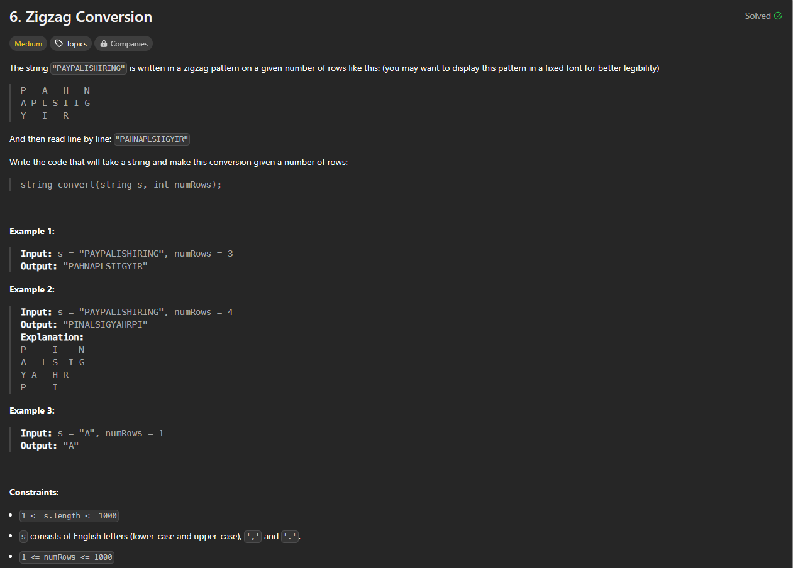

# Approach

## Problem

## Initial thoughts

I took a while to understand this problem, but once I did, I thought that a matrix would probably be the way to go. So I went on trying to set up the matrix.

## Initial attempt

My initial attempt had me trying to initalize and prepopulate the array according to the size of the string and the number of rows I'd need. Then, I would go up and down the matrix adding in the characters one by one. 

## Obstacles

Traversing the string and matrix were simple. I just had to keep track of when I needed to change directions. The main issue I ran into was the logic behind prepopulating the array with the correct number of columns. I was trying many different combinations of formulas to try and get an accurate calculation of the number of columns because, if I didn't, I'd get an index error when trying to set a specific index of the matrix.

## Conclusion/Things I would do differently

Turns out, I didn't need to do any of that at all. I just needed to set an array of empty arrays according to the number of rows, and then append to each array accordingly. No need to bother prepopulating or calculating. I did eventually manage to get the set matrix size solution to work, but it was also awfully slow. I added the initial solution to the .py file. It was headed in the right direction, but the execution wasn't all the way there.

## Score

