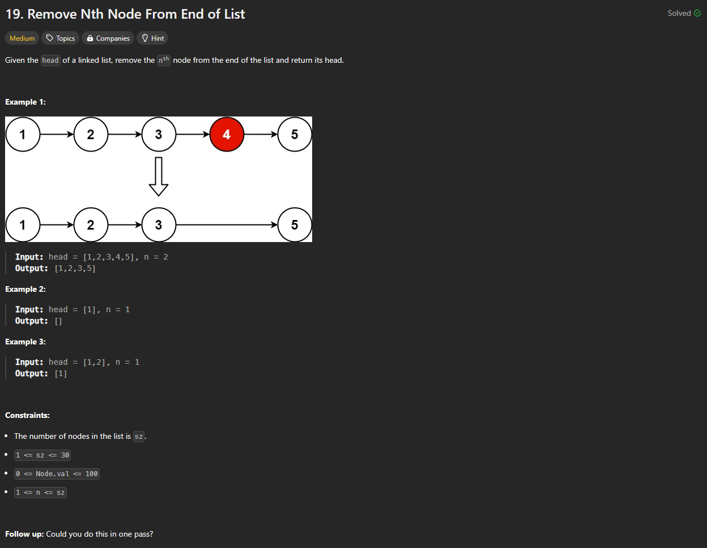

# Approach

## Problem

## Initial thoughts

Traversing a linked list in order to remove one specific index. This just shouts two pointer. Not sure if it's the fastest way, but seems the most simple. We want to remove the nth node from the end, so we simply have to separate the fast and slow pointers by n.

## Initial attempt

First attempt was my only attempt. It just worked. I have three pointers for a previous as well. I first move the fast pointer n-1 spaces past slow. Then I move slow and fast to their positions. Finally, I put some logic to handle edge cases where n is the same size as the list.

## Obstacles

Only main obstacle was handling the edge cases, but that was simple enough. I just checked if slow was head and if fast was slow.

## Conclusion/Things I would do differently

There is a cleaner way to do this. I could shrink it down to only using two variables instead of three. I can also probably handle the edge case better. Theoretically, I should be able to handle when n == sz earlier on. Doing all of this would probably dramatically reduce the amount of lines of code, but that's for another day.

## Score

