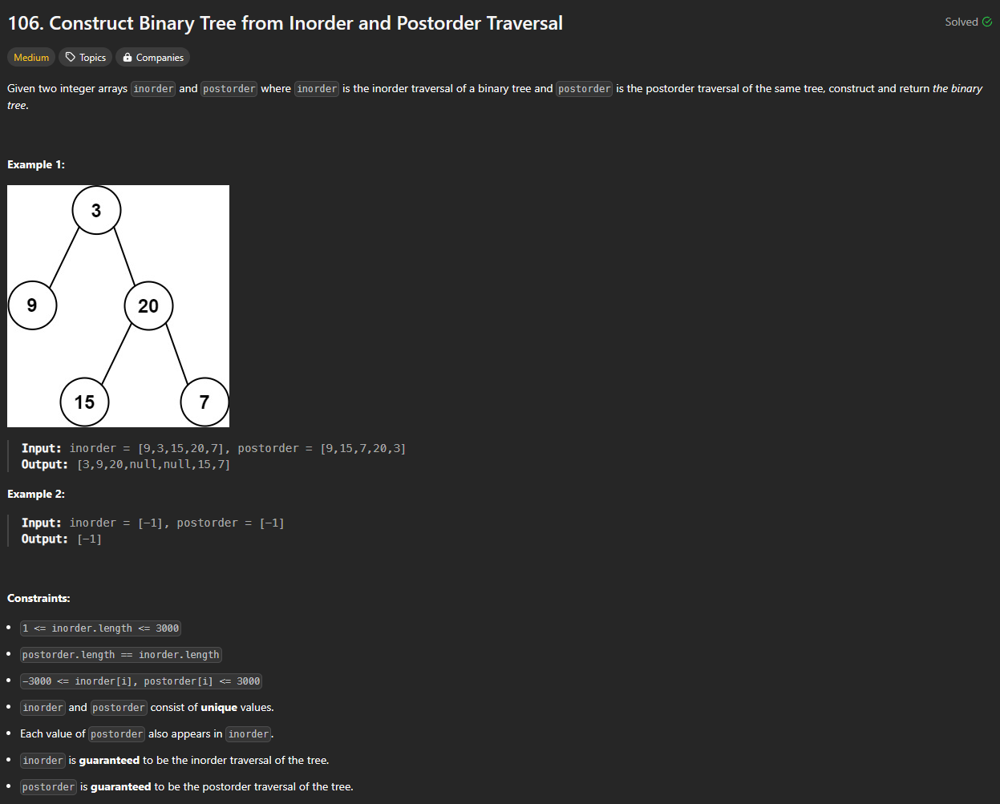

# Approach

## Problem

## Initial thoughts

So I sort of cheated on this one. I had done a similar problem not too long ago where I had to construct a binary tree from in and pre order traversal rather than in and post. The techniques are exactly the same essentially. All I had to do, first of all, remember the logic, and then convert that logic to work with the alternate traversal method.

## Initial attempt

Since I was simply remembering the logic this time, I should talk about the attemps I made before I learned how to accomplish this. Originally, the plan was to somehow utilize recursion while comparing the two lists. That's extremely vague, but I knew, or at least had a strong assumption, that that was a solution. Early on, I noticed that, at the time, the preorder traversal always had the first index as the main root. Knowing this, I would simply need to compare that value with the inorder list. This works because all of the node values are unique. I would then split the inorder list between the left and right halves with knowledge of what index is the root node.

## Obstacles

It was about where I was splitting the lists where I couldn't see the next step. I tried multiple things that I have since forgotten, but I remember that nothing was working. I finally caved and looked at the solution after about an hour of trying things.

## Conclusion/Things I would do differently

Just as I had thought, the solution was fairly simple. It involved sending entirely snippets of the original lists back into the method for the left and right nodes. I was getting stuck because I was only thinking about how I could send singular nodes or values back through recursively. The more of these challenges I do, the more I realize how small my mind's field of vision is for thinking of new solutions. There's always new techniques to learn or new ways of thinking to, well, think about.

## Score

