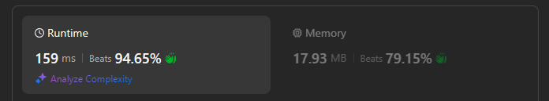

# Approach

## Initial thoughts

This problem is fairly simple and easy. It simply asks to find the majority element of an array. How one might normally go about this is by keeping a record of each unique element's frequency. A for loop to traverse and then a dictionary for storage. As I have already done this problem before, I decided to try the follow up. The follow up asks for linear time and O(1) space. Thus, storing the frequencies is no longer an option as that takes O(n) space.

## Initial attempt

I spent a bit longer than I should have at the beginning simply trying out different methods in my mind. Maybe I could keep a single tally that counts up or down based on if the current number matches the previous number. Maybe I could take the average of the list and find the majority that way. It was a long and silent five-ish minutes. 

## Obstacles

As I had nothing written down yet, it's weird to say that I ran into obstacles. However, there were still issues to be resolved when thinking about solutions in my head.

The first issue was with the tally system. I would need to keep track of the element that was currently tallied and also keep track of when the element changes due to the tally changing. As I type this out, I think I could figure out a solution using this method, but it all seems very messy in my mind.

Another issue I found was with the average method. There are cases where the average does not round down or up consistently with the majority element, so that idea is just out. Unless there are other measures of central tendency that translate into O(1) space code, I'm not sure that this is an option.

## Conclusion/Things I would do differently

Finally, I realized something when I looked at the definition for a majority element, "The majority element is the element that appears more than ⌊n / 2⌋ times." The majority element always takes up more than half of the space in the list. That means that if sorted, the middle value should always be the majority element. Of course, that means I'd have to sort the array, which at the best worst-case will only ever be O(n log n). That means this solution isn't 100% accepted as it only satisfies one part of the follow up, but today is a busy day, so an actual solution will have to wait till later.

## Score

