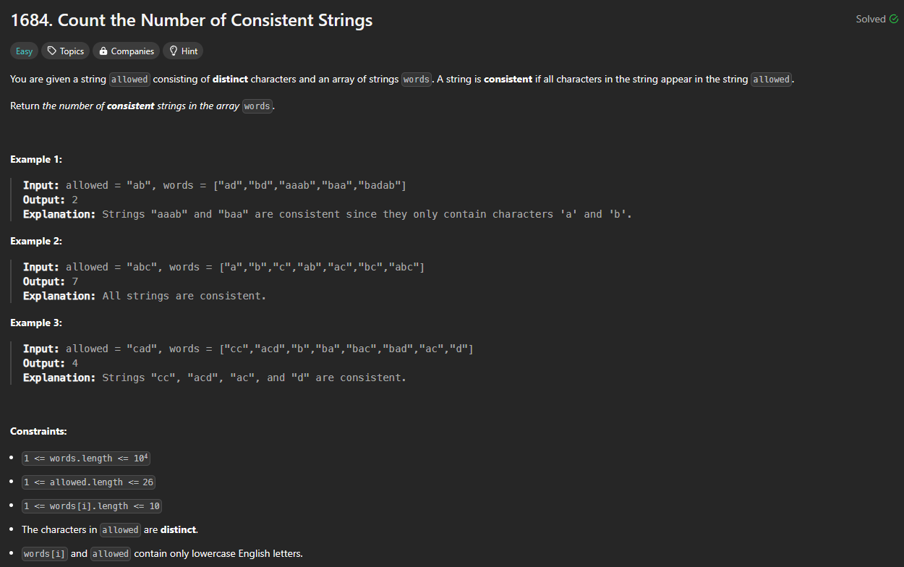

# Approach

## Problem

## Initial thoughts

An easy match string problem.

## Initial attempt

Turn the allowed string to a set for fast lookup times. Run through each word in words, and each letter in word. If letter is not in allowed, break. Keep a running total throughout.

## Obstacles

No major obstacles.

## Conclusion/Things I would do differently

I've seen a few solutions that are essentially the same as mine. They somehow got it faster, but I think that's just on LeetCode's end. There are also one line solutions that are fun, but a lot of those are slower.

## Score

