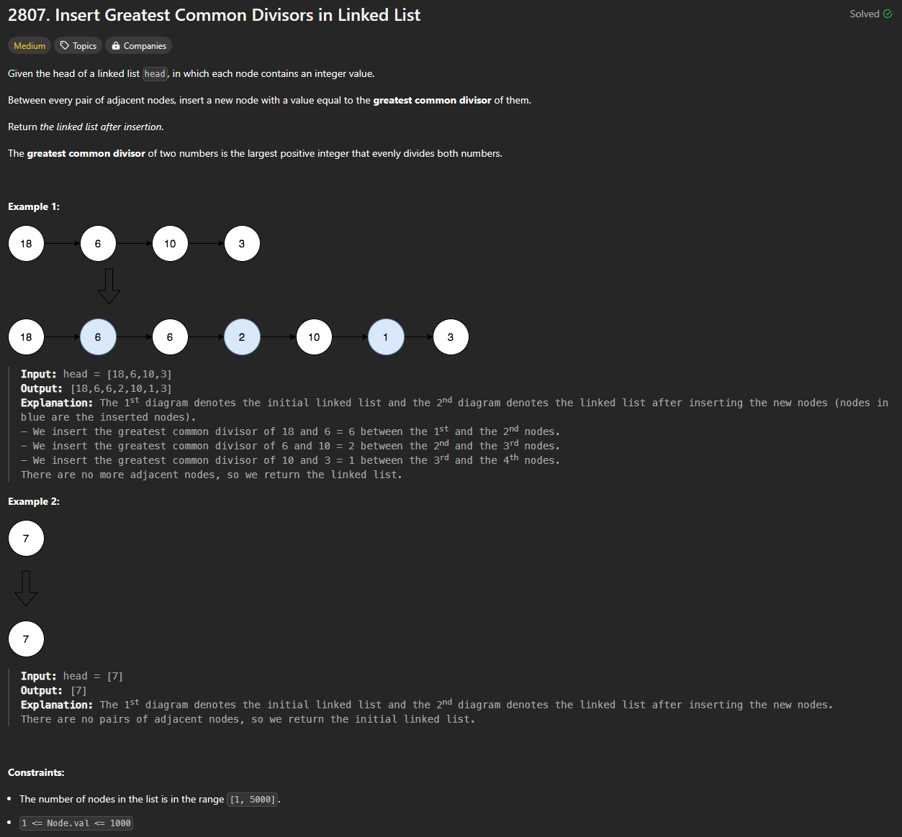

# Approach

## Problem

## Initial thoughts

A simple linked list traversal. Set up two pointers and just insert a new node between them.

## Initial attempt

Initial attemp was the only attempt I made. I set up a cur and prev pointers, started a while loop, and went from there.

## Obstacles

The actual obstacle was remembering math.gcd() off the top of my head. I couldn't, so I had to look it up.

## Conclusion/Things I would do differently

You can use less space by only using cur and cur.next. You can also void the base case I put in at the top. These aren't the most impactful changes though, so I didn't bother with them.

## Score

