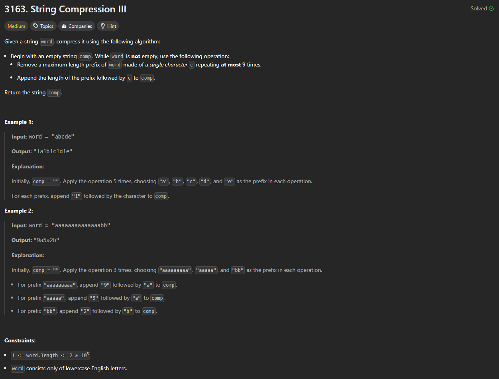

# Approach

## Problem

## Initial thoughts

Fairly straight forward problem. Just iterating through a string while adding to another string upon certain cases.

## Initial attempt

Initial attempt had me updating the comp string whenever an additional same letter was found. I would convert the comp[-2] to an int then back to a string to add it back to the main string comp[0:-2]. This was very slow though. So, instead, I went for just keeping a count of the number of same characters and only adding to the string once a different character was found or when the count reached 9. 

## Obstacles

No real obstacles.

## Conclusion/Things I would do differently

Again, straight forward problem with many solutions. The real challenge is to do it as fast as possible.

## Score

