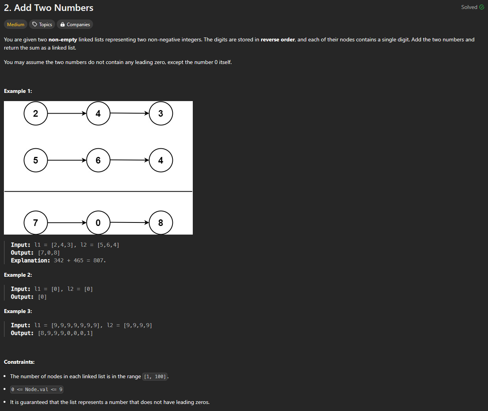

# Approach

## Problem

## Initial thoughts

Simple linked list problem that I struggled with for some reason.

## Initial attempt

Main idea is to iterate through both linked lists at the same time. Add the values of both linked lists and check if they carry over past 9. Add a new node with the value and keep track of whether or not we are carrying a digit over. If either linked list ends before the other, just keep going until all of l1 and l2 are done and we are no longer carrying any digit over.

## Obstacles

The main thing I struggled with was the logic behind checking the sums and whether we should carry over. I initially checked to see if l1.val + l2.val > 9. This caused order of operations issues in my solution at the time. Eventually, I got to the modulo option which was much cleaner.

## Conclusion/Things I would do differently

I am not sure why I struggled so much with this one. I've done many of these in the past and it should have been fairly easy for me. Just shows how one should get complacent I guess.

## Score

