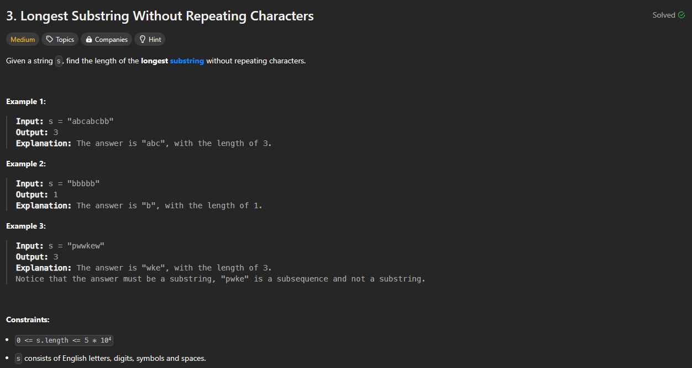

# Approach

## Problem

## Initial thoughts

Sliding window problem that needs to maintain a unique set of characters in the window.

## Initial attempt

Main parts of a sliding window is moving left based on what is found on the right. In this case, we need all parts of the window to be unique, so we can use a set. Whenever we move right, we check if the character is in the set. If it is not, we add it to the set, update our max length, and move on. If not, we move left forward until we are back to a complete set.

## Obstacles

Main obstacle was making sure the logic actually made sense and worked in all cases. 

## Conclusion/Things I would do differently

## Score

