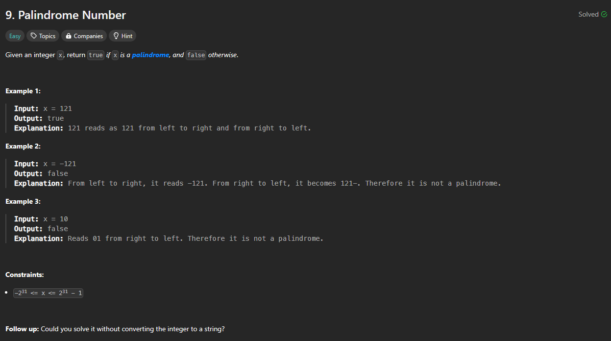

# Approach

## Problem

## Initial thoughts

Checking palindrome. 

## Initial attempt

Simple check both ends to see if they match and then move them inwards.

## Obstacles

No obstacles

## Conclusion/Things I would do differently

Didn't do the follow up, so this was just a simple and easy day.

## Score

