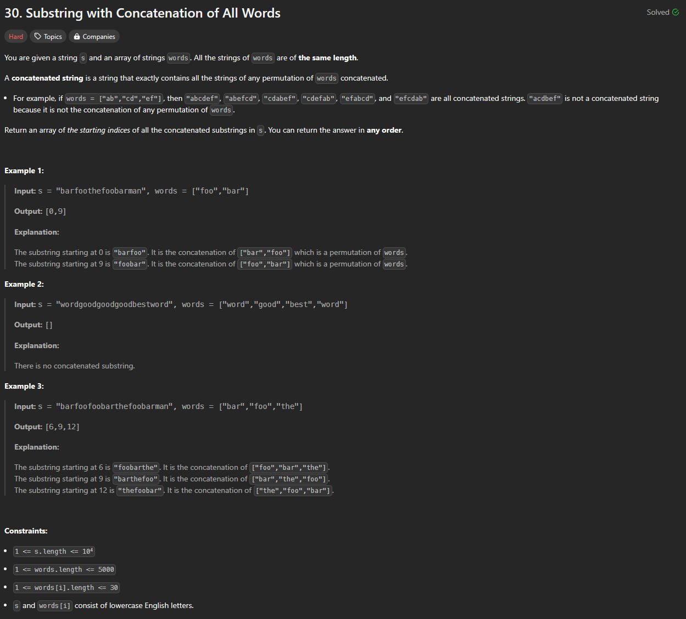

# Approach

## Problem

## Initial thoughts

This was a very difficult sliding window problem. At every point, there were just more and more cases that I had to account for. 

## Initial attempt

My solution went through a few iterations as I kept running into new cases that I didn't account for.

At first, I simply iterated through the string by every len(words[0]), but that didn't account for indices inbetween.

I then iterated through every index, and iterated forward again to check for matching words, but this was too slow.

## Obstacles

At the end, I got to a solution that was relatively stable, except for the fact that it was again too slow for large inputs.

## Conclusion/Things I would do differently

I ended up with a more brute force solution that simply compared sorted strings at every index. This of course will never be as fast as a proper sliding window due to the speed limitations of sorting, but this was the best that I could manage for now. 

## Score

