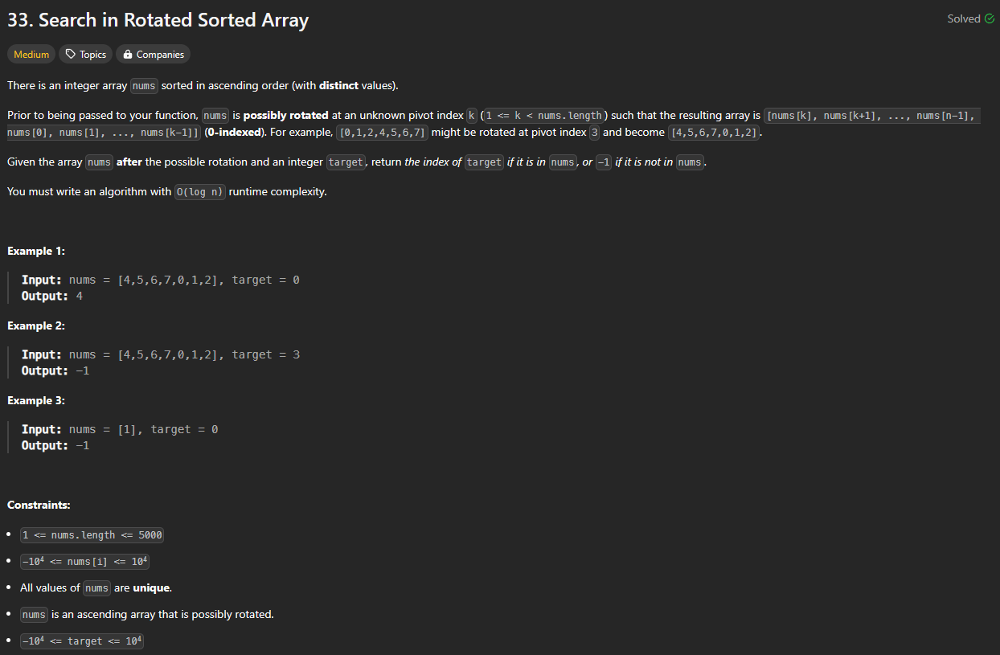

# Approach

## Problem

## Initial thoughts

Searching if a number exists in an array in O(log n) time means binary search. Main difference is that the array might be rotated. That means our logic for deciding whether to move left or right will be different.

## Initial attempt

For my first and only attempt, I used a lot of if/else statements. If left or right were correct, I returned them right away so as to not have to deal with those edge cases. Afterwards, it was just dealing with what can happen on the left side and what can happen on the right. Either side can be either fully sorted or half sorted, so we would just have to recognize those cases depending on left, right, and mid.

## Obstacles

Main obstacle was just figuring out what specific cases I needed to recognize in order to properly move left or right.
Another obstacle was dealing with when left/right were the target. I just moved those checks up so as to not have to deal with them.

## Conclusion/Things I would do differently

I recognize that my solution can be cleaner. There's already a solution in my head where I simply have to check if left and right are sorted rather than checking everything.

## Score

