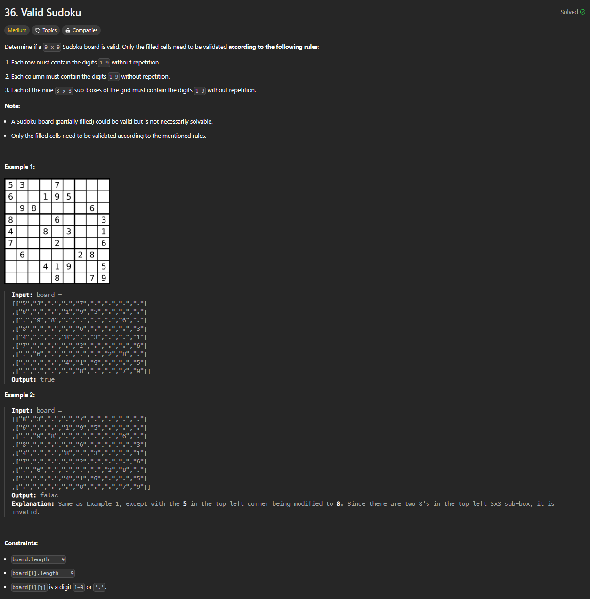

# Approach

## Problem

## Initial thoughts

This is one of those problems that I just haven't really attempted before. It always looked too much of a hassle to try and figure out. Nonetheless, I tried. 

## Initial attempt

My first attempt had me making dictionaries of tuples that would keep track of every element on the board. I would then use some logic to check if the current element was in contradiction to any other element already stored.

## Obstacles

The main issue was that, initially, my logic was taking up 40+ lines of code. It was also difficult for me to check for the boxes as well. In the end, I had to look at a solution because I was running out of time for that day.

## Conclusion/Things I would do differently

I think I was close with my initial attempt. A lot of the solutions used a dictionary or a list of tuples and compared them to sets, or just used a dictionary to check for duplicates. I was aiming more towards the latter, so that is the solution I ended up basically copying. Just another problem for me to get used to.

## Score

