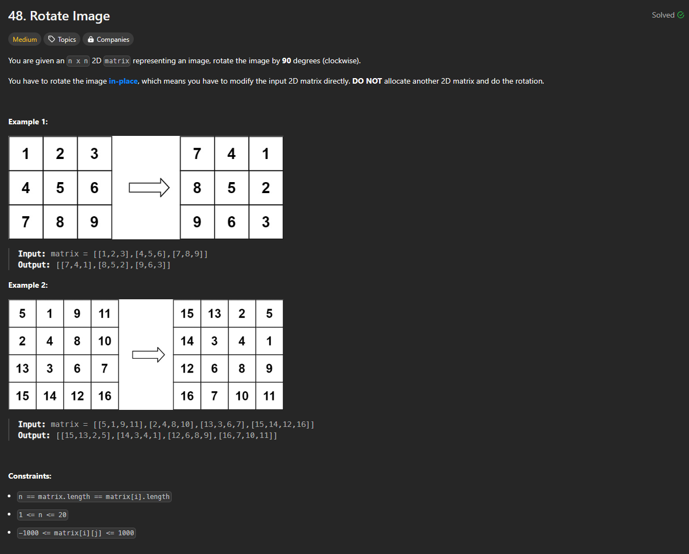
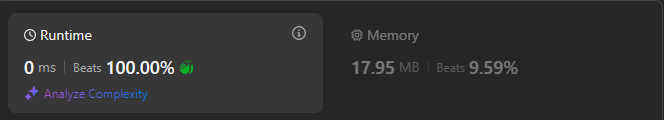

# Approach

## Problem

## Initial thoughts

Rotating a matrix. 

## Initial attempt

Typical simple method is simply reversing and then transposing. 

## Obstacles

Only obstacle was remembering how to do it.

## Conclusion/Things I would do differently

It's technically not the fastest, but definitely the simplest method.

## Score

