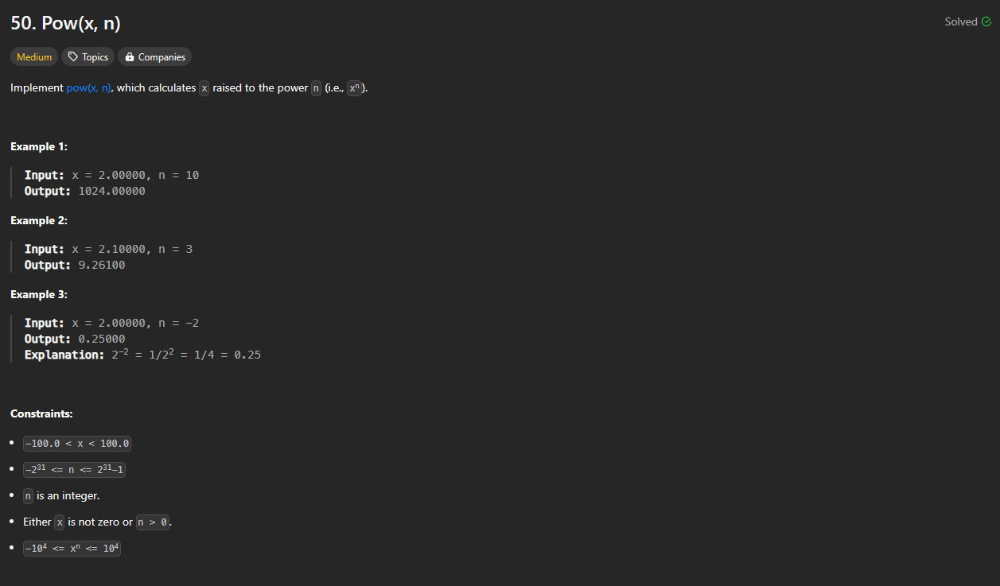

# Approach

## Problem

## Initial thoughts

This problem starts out simple by just asking you to find the power of a number. The real difficulty lies in when you try to take very large powers of numbers.

## Initial attempt

Actual first attempt was just a simple for loop through n. That was obviously too slow.

## Obstacles

The issue with the for loop is that at very large n, you are looping for basically forever. The answer then is to break that process up. I did what other people have done and learned from the reliable mathemeticians on wikipedia. This is where I found a page about "exponentiation by squaring". Basically, you take the square of x, say x * x = z. You then use that new number z and use that as your new basis for exponentiation, but because you do that, you halve the n by 2. It is a clean recursive function, but I went ahead and did it iteratively. It essentially exponentially increases the speed at which you calculate the power. 

## Conclusion/Things I would do differently

I wouldn't have solved this without looking it up. Thankfully, there always seems to be a dedicated team of volunteer mathematicians behind Wikipedia. Their work is always super detailed. Thank you strangers. 

## Score

