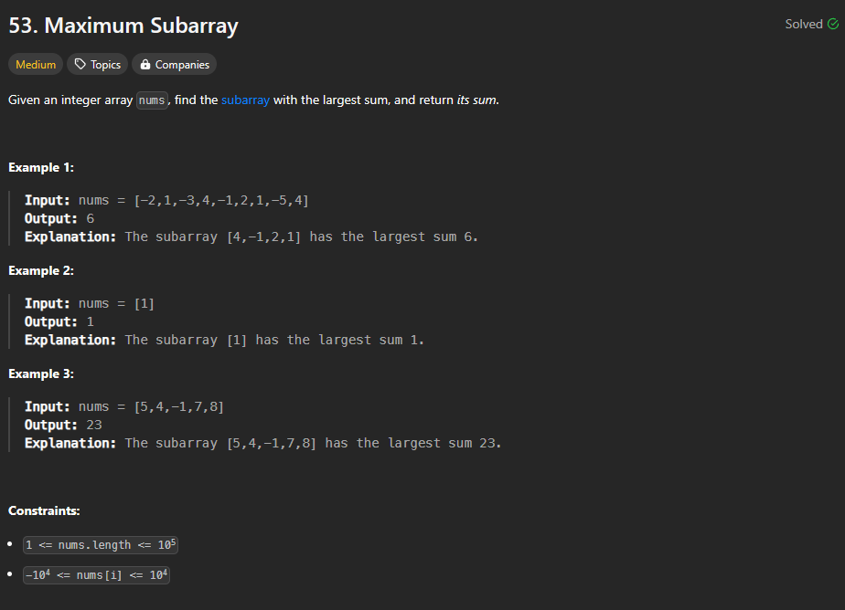
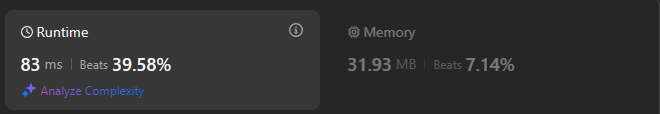

# Approach

## Problem

## Initial thoughts

Kadane's algorithm. Clean one pass solution to find the largest sub-array.

## Initial attempt

Knowing about the algorithm already, I had an easier time knowing that there was a single pass solution. 

## Obstacles

The biggest challenge was remembering the exact order in which to check things, but that wasn't too difficult.

## Conclusion/Things I would do differently

It's not the fastest, but it looks very nice. 

## Score

