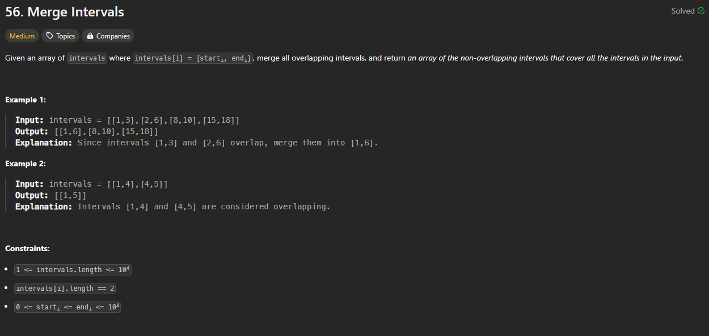

# Approach

## Problem

## Initial thoughts

This problem is relatively simple. You are simply combining intervals that overlap.

## Initial attempt

This can be done by iterating over each interval and either adding the interval to a list or updating that last interval in the list based on whether the start is greater than or less than the end of the previous.

## Obstacles

The only obstacle is that this approach requires the original list to be sorted by start values, so you must sort it first.  

## Conclusion/Things I would do differently

I didn't put any effort into cleaning up the solution. The if/else logic can definitely be shortened by a lot.

## Score

