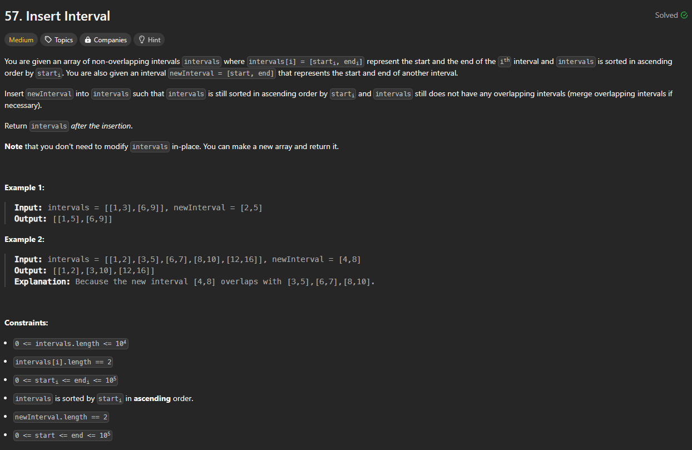

# Approach

## Problem

## Initial thoughts

Inserting an interval and merging any intervals that overlap due to the new interval.

## Initial attempt

Similar to problem 56, this can be done by simply iterating over the list of intervals and adding them to a new list. If the current interval is smaller, we just add it straight out. If the current interval is greater, then we just add the new interval and replace the new interval with our current interval so that we can add at the end later. If the current interval in any way overlaps, then we merge it into our new interval.

## Obstacles

The main obstacle was with dealing with what to do when we already added our new interval. That was solved by just replacing the new interval with the greater current intervals so that we wouldn't repeat anything.

## Conclusion/Things I would do differently

This was also relatively simple. The hardest part was just dealing with all the logic as cleanly as possible.

## Score

