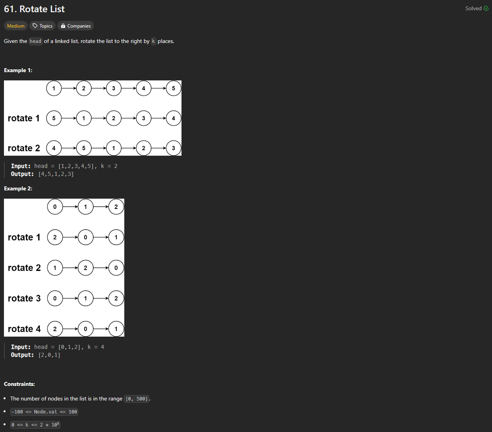
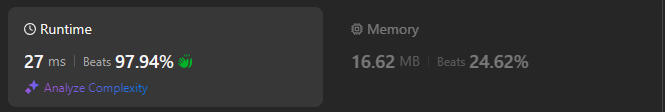

# Approach

## Problem

## Initial thoughts

This problem is similar to a two pointer problem except that the potential for k to be longer than the length complicates things.

## Initial attempt

Set up fast and slow pointers, move fast all the way to the end to check length. Take the remainder of k and length to find rotation amount. Then, send slow pointer based on rotation.

## Obstacles

It wasn't really an issue, but making sure to change the .next values in the correct order took a minute longer than it should have. 

## Conclusion/Things I would do differently

At first, I wasn't too keen on using two consecutive loops, but that all went away when I looked at other solutions. I think the only thing I need to worry about is using less space next time.

## Score

