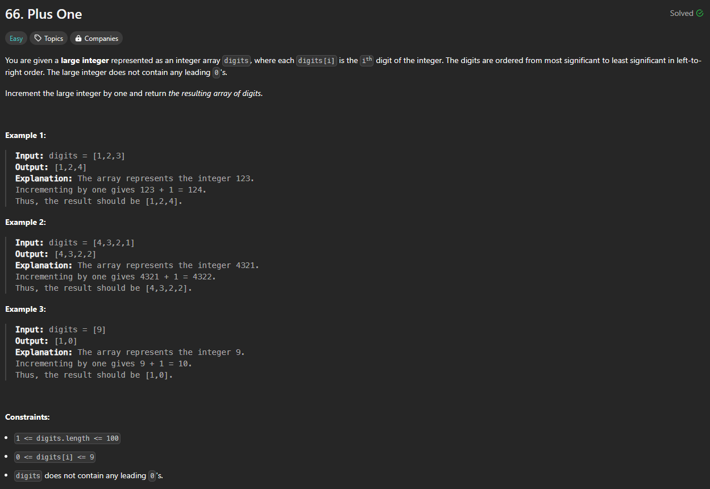
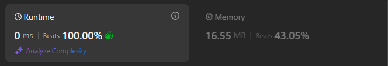

# Approach

## Problem

## Initial thoughts

Simple problem that has slight surprise cases that I had to account for in succession.

## Initial attempt

Main thing is just adding 1 to the last index entry: `digits[-1] += 1`.

## Obstacles

As you keep going though, you have to think what happens when the last digit is 9. Well, then you'd have to turn the last digit into a 0 and add 1 to the second to last digit.  
Well, what about when 9 is the only index entry? Then you'd have to insert a 1 to the first slot. 
What about when there are multiple 9s in a row? You'd have to loop through the indices until you get to a non 9 entry. 
And finally, what if there are only 9s in the array? Finally, we can just loop through them to make sure they are all 9s, and insert a 1 to the beginning.

## Conclusion/Things I would do differently

It's fun to think about how many steps go into simple addition that we just come to think as natural and more or less forget about. 

## Score

