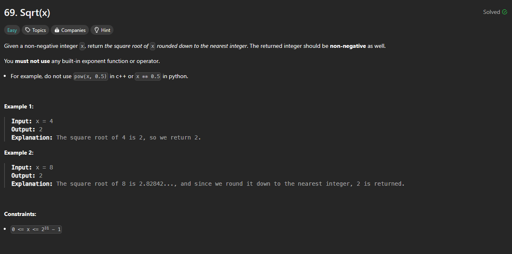

# Approach

## Problem

## Initial thoughts

I've never bothered to learn how to manually square root a number before. It always seemed like hassle whenever I briefly looked it up in the past. So I had to look on line a little to figure out ways how to do by hand. Unfortunately, that only got me more confused.

## Initial attempt

Fortunately, with the power of computers, you can brute force your way through a lot of repetition based problems. One of the ways of finding the square root by hand was by just approximating, comparing, and repeating. That sounds an awful lot like a binary search, so that's what I did. Mid will equal half of 1 and x, and we keep moving left and right until we get to a mid that is accurate.

## Obstacles

No real obstacles

## Conclusion/Things I would do differently

There were some other solutions that actually implemented how you'd do it by hand, but that's beyond my motivations right now. 

## Score

