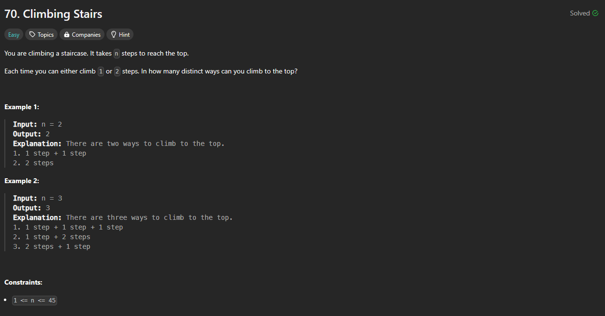

# Approach

## Problem

## Initial thoughts

This was a fibonnaci sequence problem. So we make fibonnaci.

## Initial attempt

To implement fibonnaci counting, we have to add the last two steps to get the next step. That is simply a = b and b = a + b where a is always getting replaced by b, the next step, and b is always getting replaced by a + b, the step after b.

## Obstacles

The biggest obstacle was recognizing that it was just a fibonnaci problem. I haven't done anything that worked with fibonnaci sequences in so long, I first forgot about them, and I also forgot how to implement them.

## Conclusion/Things I would do differently

Just gotta keep this stuff in my head better I guess.

## Score

