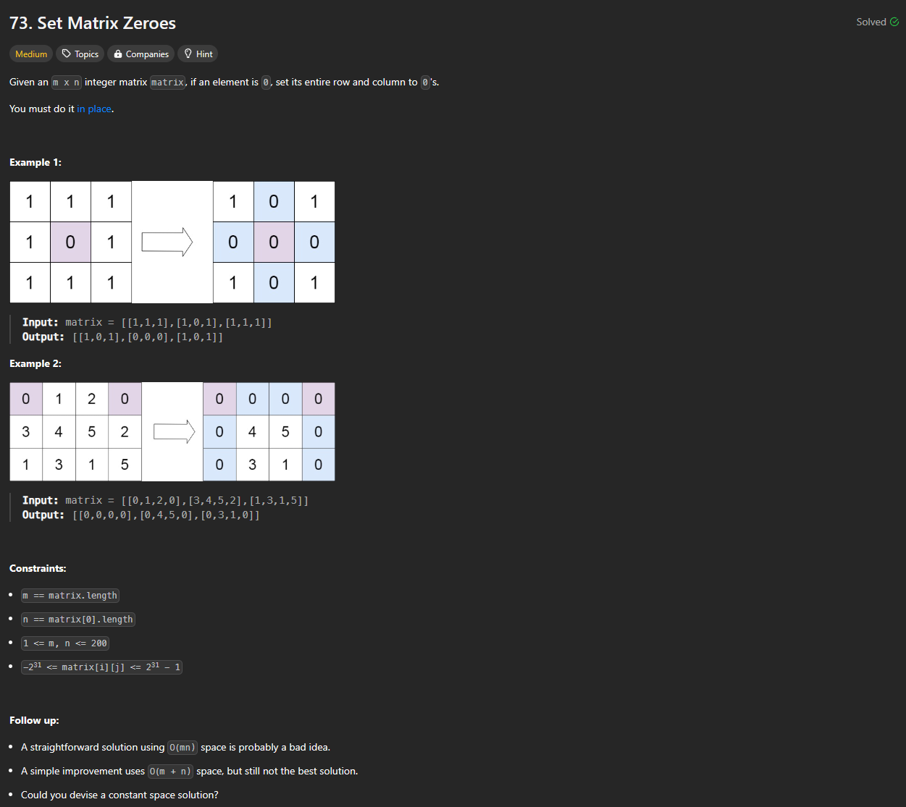

# Approach

## Problem

## Initial thoughts

Matrix problem. It's a little complicated because you want to keep track of the new zero indices while still recognizing the old zero indices.

## Initial attempt

Idea is to keep track of the new zeros in a different matrix m x n. Go through the original matrix and set the zero rows and columns to true in the new matrix. Then, just go back through the new matrix and switch the old matrix based on true indices.

## Obstacles

No real obstacles.

## Conclusion/Things I would do differently

The solution uses O(m x n) space. I am unsure if I could get the constant space solution within a reasonable amount of time.

## Score

