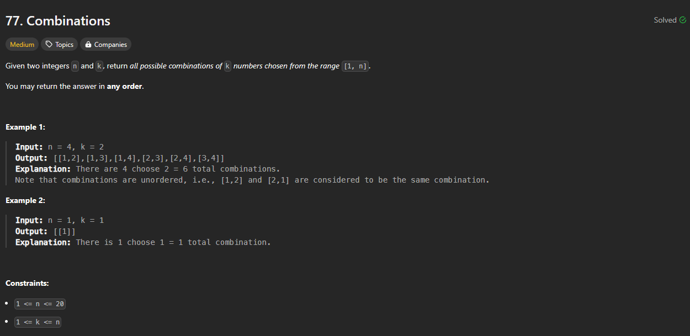
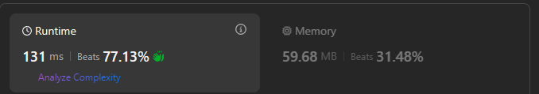

# Approach

## Problem

## Initial thoughts

Backtrack solution. First time, so I got many things wrong.

## Initial attempt

THe idea of backtracking is to go through candidates and the delete them as soon as it can be determined that the candidate is not the solution. This can be done cleanly through recursion. Create an empty result list. Define a function that accepts k, an empty list, an integer. These will represent the remaining partial candidates, k, the partial solution, comb, and the rest of the current partial solution.

## Obstacles

Having never done a backtracking algorithm, it was difficult to translate the generic idea into a form that would solve this problem. 

## Conclusion/Things I would do differently

I need more practice.

## Score

