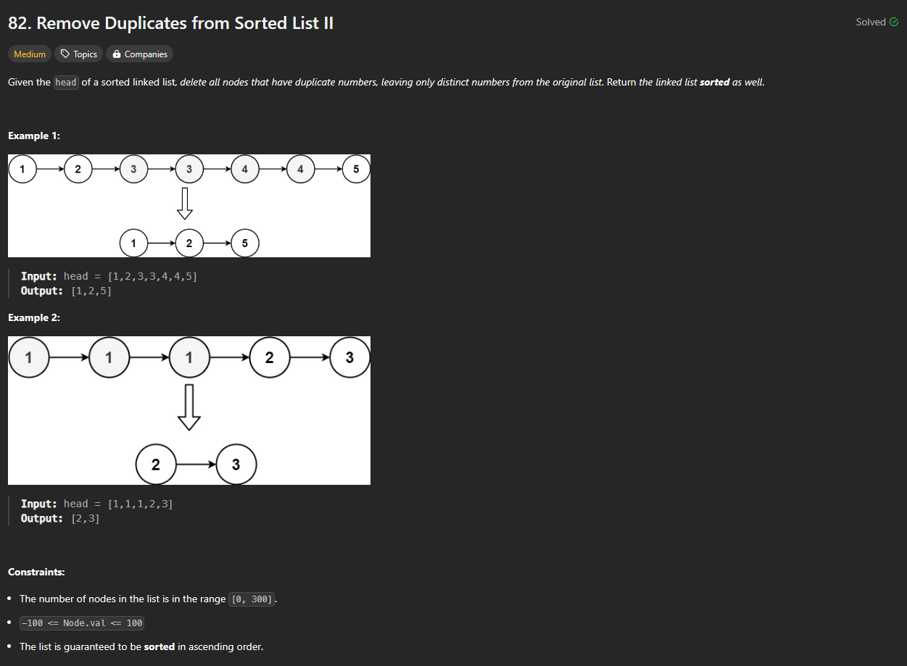

# Approach

## Problem

## Initial thoughts

A little more difficult than just removing extra duplicates. Here, you have to remove any number that has duplicates entirely.

## Initial attempt

I thought off a few methods at first. The main thing is checking to see if a number duplicates in the first place. To do so, we can loop through a number and the next nodes to see if there are duplicates and keep going until there are none. Then, depending on if there were duplicates or not, we either move our prev and cur forward because it was all good, or we keep the prev and connect the next number because we found duplicates.

## Obstacles

The biggest challenge was figuring out how to do go through with my solution cleanly when the first node was a duplicate. What I ended up having to do was create a new node beforehand and connect it to the head node so that I could use it for prev at the start and also use it as a marker for the front without it disappearing due to being deleted.

## Conclusion/Things I would do differently

This problem ended up being more work than I originally thought it would be. Good practice for remembering to use dummy nodes.

## Score

