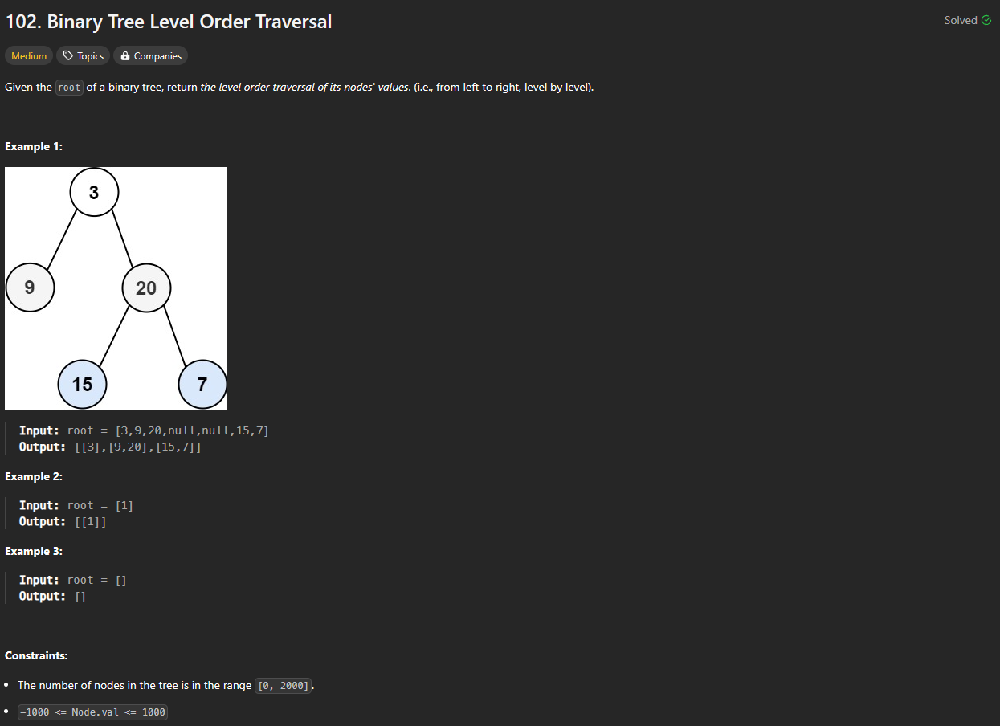
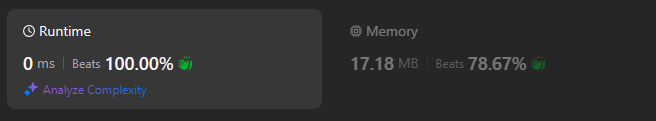

# Approach

## Problem

## Initial thoughts

Just a simple level order traversal problem of a binary tree. 

## Initial attempt

The problem was asking for so little that I wasn't too sure at first if I understood it correctly. Level order traversal for a tree is just a constant emptying and refilling of a queue. You take out nodes and add in their child nodes.

## Obstacles

I guess the obstacle here was the output format? It wanted you to output each level as its own list, so I had to add that in real quick using a temporary list.

## Conclusion/Things I would do differently

I could make it faster with collections.deque, but for some reason, LeetCode said my solution took up 0ms, so my solution is already infinitely fast! Amazing.

## Score

