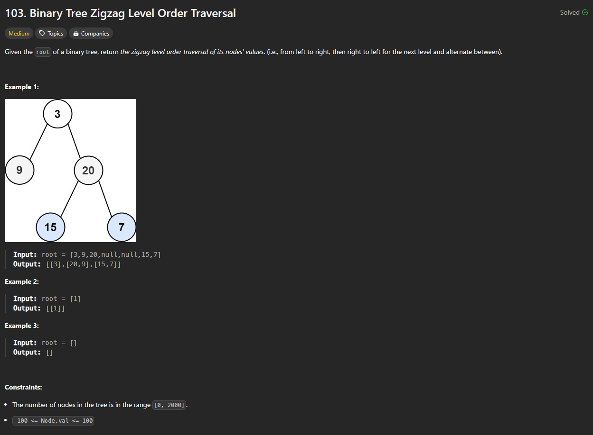
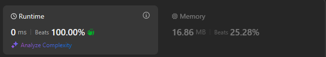

# Approach

## Problem

## Initial thoughts

Just a simple level order traversal but with alternating layers. This can be done by simply switching the way you add node values to a list. 

## Initial attempt

Standard level order traversal. The only difference is that we keep a running number, i = 1. When i is positive, we append node values. When i is negative, we insert node values. We also change the sign of i on every while loop end.

## Obstacles

No real obstacles

## Conclusion/Things I would do differently

After looking at other solutions, it seems like my solution is about as simple as you can make it. So I am happy with this.

## Score

