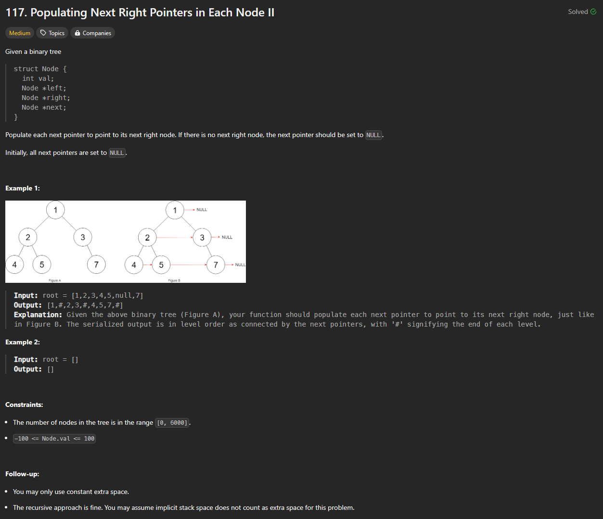
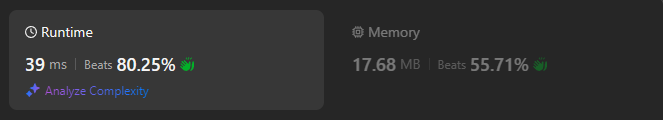

# Approach

## Problem

## Initial thoughts

Problem essentially wants a level by level approach to the binary tree, so a level order traversal would be best.

## Initial attempt

I cheated a little by checking how to do a level order traversal, but the gist is that you use some queue or list to store the nodes, then you iterate through those nodes based on how many you added, all the while popping the checked node but also adding in the next layer of nodes. 

## Obstacles

The main obstacle was remembering how to implement it, so I looked it up.

## Conclusion/Things I would do differently

After looking at a few other solutions, I saw this guy use a deque() rather than a simple list. Double-ended queues are just structures that are faster at popping or appending, removing/adding from/to the ends. So I changed my solution to use it. Nothing big, but it's cool nonetheless. 

## Score

