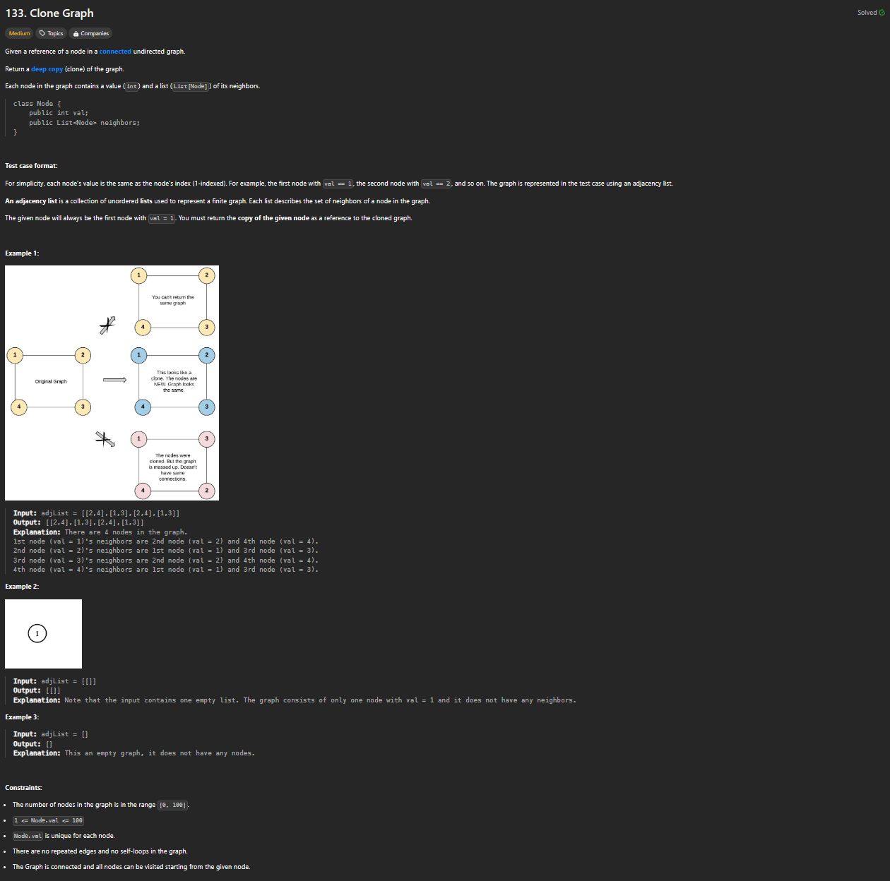
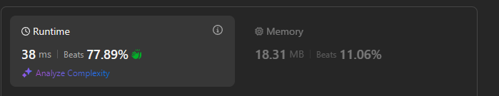

# Approach

## Problem

## Initial thoughts

Deep clone a graph.

## Initial attempt

The main idea is to keep a record of nodes that you already created whilst creating new nodes. Create a copy of the first node, add it to a hashmap (hashmap because node values are guaranteed to be unique), when adding the neighbors, create the neighbors or return the already created neighbors.

## Obstacles

Main obstacle was figuring out the order of operations. 

## Conclusion/Things I would do differently

Graphs are tough. It took me a while to get to this point.

## Score

