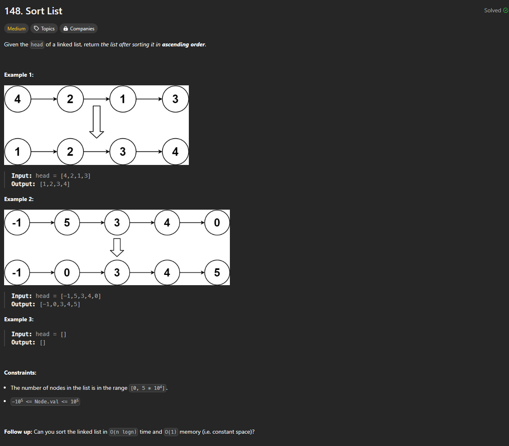

# Approach

## Problem

## Initial thoughts

Simple reordering a linked list. First thought is to just put the list into a dictionary and sort from there.

## Initial attempt

While loop through list to add to dictionary. Then, go back through the dictionary by sorted value and update each node's .next value.

## Obstacles

At first, I made the node's value the key for the dictionary, but this meant that duplicate values would not be stored. To get around this, I simply made the nodes the keys and the .val the values.

## Conclusion/Things I would do differently

This was my first time attempting this problem, so I did not try the follow-up.

## Score

