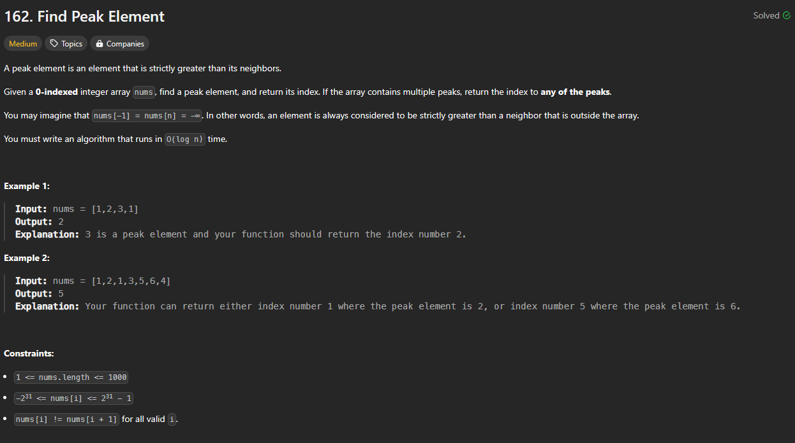

# Approach

## Problem

## Initial thoughts

We need to find any peak whether it is in the middle or on the edge. We just have to find it in O(log n) which means it's some sort of binary search solution. The main differnce is that the given array is not necessarily sorted, so the logic will have to be a little different.

## Initial attempt

First attempt had me looking at some of the edge cases or smaller cases. I tend to do this because of the typically small list sizes in the examples given. An important thing to note is that the length of the array can be as small as 1 and that the "edges" outside of the array are always smaller. This means that any sole index is automatically the peak. Thus, I went about looking for all of the cases where the answer can be seen from the very beginning. Lists of size 1-2, and lists whose peaks are at the very edges. In reality, these aren't at all necessary and are actually sort of redundant, but I keep them because they make me feel better for some reason. 

The main meat and bones of this is the binary search algorithm. A simple left, right, mid, but then there laid the logic of searching through an unsorted array.

## Obstacles

Normally, the unsorted nature of the list could prove to be a problem. However, this problem is overcome by the fact that `nums[i] != nums[i + 1] for all valid i`. This basically means that we don't ever have to worry about consecutive duplicates, and that there is always going to be an answer no matter what. So, all that's left to do is choose what direction to go in if the first mid point is not it. Given that we need to find a peak, that means going towards whatever side had the bigger number.

## Conclusion/Things I would do differently

This turned out to be a relatively simple problem due to the constraints put onto the lists. I should keep in mind how much time certain base cases actually save before I add them in. Interestingly enough, my first submission, which was the messiest and least logically efficient, ended up being the fastest. Go figure. I added a cleaned up solution under class CleanedSolution, but I can't seem to get LeetCode servers to run fast enough to prove it.

## Score

