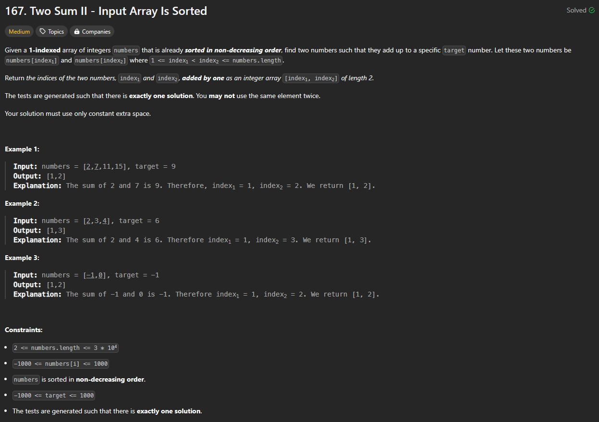

# Approach

## Problem

## Initial thoughts

Find two indices whose values add up to target, but as fast as possible and with O(1) space.

## Initial attempt

First attempt was using two loops that would break once the sums reached a certain point. The faster way was to do it with two pointers, left and right, that increase or decrease based on the size of their sums.

## Obstacles

No real obstacles.

## Conclusion/Things I would do differently

Straightforward and simple.

## Score

