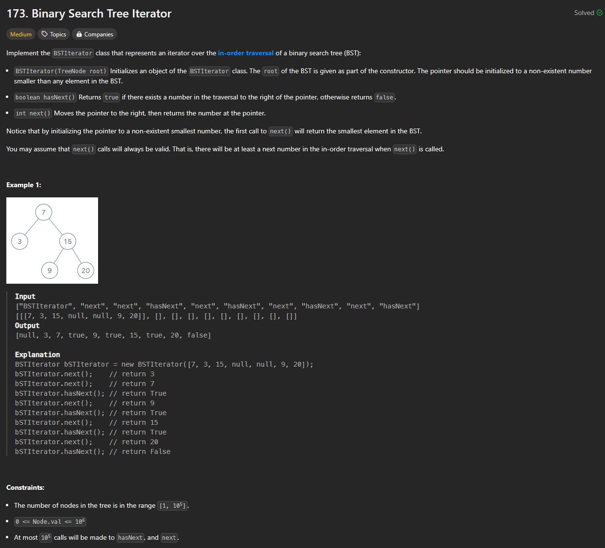

# Approach

## Problem

## Initial thoughts

Implement an iterator that iterates over a BST in-order. The main thing about this problem is that it says to create an iterator that should technically involve pointers, but what it asks for doesn't ever require it. 

## Initial attempt

This might be a cheaty method, but I figured that we can simply add all of the values of the BST to an array and just return the values of the array or check if there is more to the array when calling .next() or .hasNext(). Simply iteration over the BST, add all the values to an array, and keep track of the index when .next() is called.

## Obstacles

No actual obstacles due to the simplicity of it all.

## Conclusion/Things I would do differently

This solution isn't really in the spirit of the problem being asked, but I find that the problem domain should have been narrower if a specific method was wanted. The only issue with my solution is that it will never be faster than using a pointer. Upon initialization, the class will always look through the entire tree, even if the .next() or .hasNext() is never called. So it is strictly O(n) and only O(n) rather than O(h) where h represents how many times .next() or .hasNext() is called.

## Score

