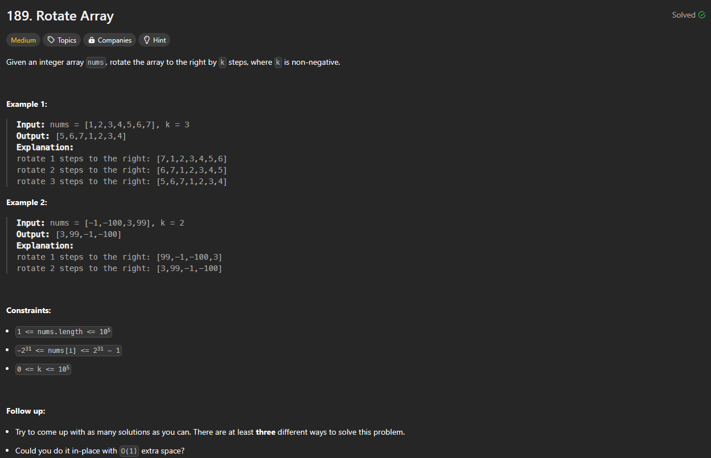

# Approach

## Problem

## Initial thoughts

Having done this problem before, I was looking to do it a different and faster way. Previously, I just for looped over the array using pop() and insert(), but that is really slow. 

## Initial attempt

What I thought might be faster was just slicing the array entirely. So I did just that. In order to stay consistent for when k was greater than the length of the array, I took the modulo of k and n. Afterwards, it was a simple adding the second half of the array in front of the first based on k.

## Obstacles

The main obstacle was remembering how to slice in place. Slicing normally just creates a copy of the array. To account for this, I simply had to replace the array with the sliced portions of the array.

## Conclusion/Things I would do differently

Still not sure if this is the fastest, but it beat 98% of solutions. Obviously the scores aren't super reliable due to the casual nature of how they are ran, but still. 

## Score

