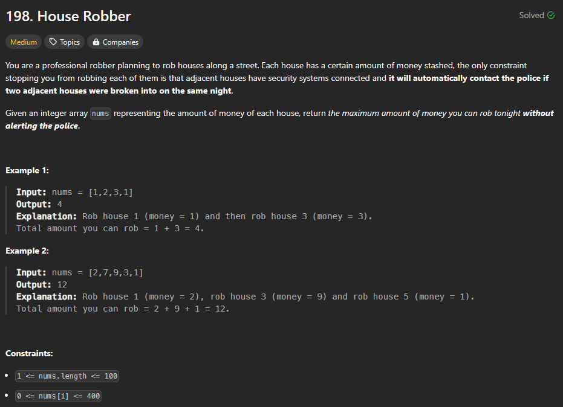

# Approach

## Problem

## Initial thoughts

Dynamic programming problem. These are often difficult for me to think of right away. 

## Initial attempt

Recursion was my first thought. We have to maintain a memory of a previous max while adding to a new max. But that just means we can do it iteratively with two previous variables. 

## Obstacles

The biggest obstacle was determining the order in which to store information and rewrite it.

## Conclusion/Things I would do differently

This type of problem is still very difficult for me to do. I don't think I could do it on a timer, at least cleanly. 

## Score

