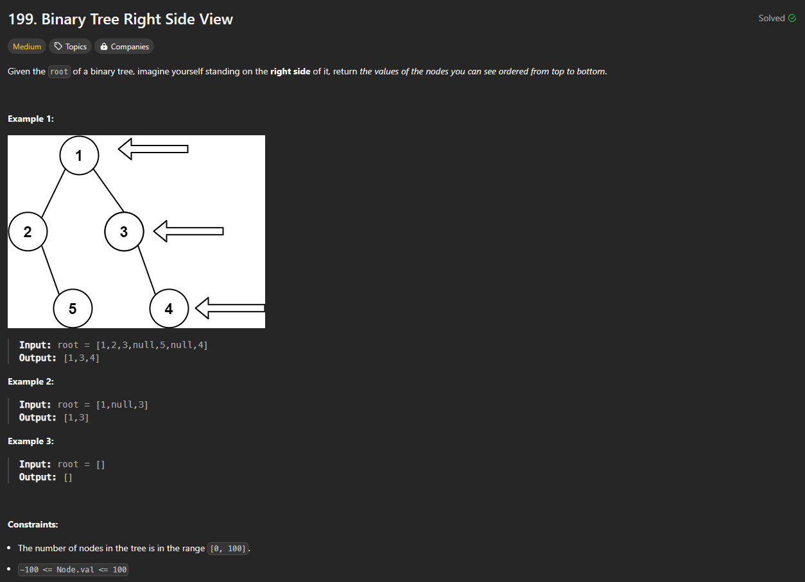

# Approach

## Problem

## Initial thoughts

Going into this, I never really worked with BFS or Level Order Traversal. So, I went ahead and look up how most people did it. It's a fairly simple method that uses a queue to iterate over and store the next and next level. Armed with this new knowledge, I tried to apply it to this problem. The key difference being that we simply need the right most node of any level. 

## Initial attempt

Initially, I thought that I could perhaps separate the levels into temporary queues. That way I could isolate each level to make sure I found the last node of each level. 

### Obstacles

The main issues with this attempt was one, it was really messy, two, used up more space than I'd like, and three, was going to be very slow considering that I'd need to iterate over each level potentially multiple times. All the while trying this attempt, I already had another method in the back of my mind. So, in the middle of this, I jumped ship and tried a differnt method.

## Second attempt

Second time through, I thought of keeping track of what level I was on. Originally, I was going to keep a separate variable on hand, but that didn't work out too cleanly in my head. So, I decided to store the level that each node was on right next to the node in a tuple. By doing so, I would simply have to extract the level, h, of the node I was looking at and store its children with a level of h + 1. 

### Obstacles

A big issue with this attempt was how I decided what the last node of each level was. I was checking it by keeping a previous node and storing its value if the h value changed. The problem with this is that it wouldn't check the last level because there would be no new h. To get around this, I simply also checked if the queue was empty to determine the last level.

## Conclusion/Things I would do differently

I haven't looked at other solutions yet, but I am unhappy with how messy this solution is. It uses multiple variables simply to keep track of stuff and another list for the answer. Next time I see this problem, I will try to use less space overall.

## Score

