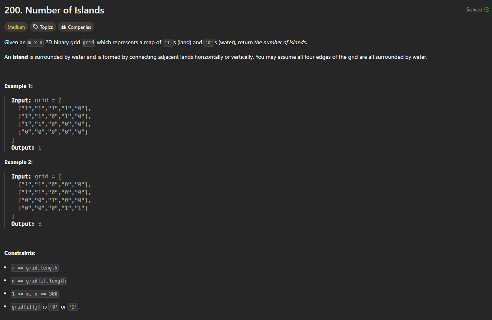

# Approach

## Problem

## Initial thoughts

This problem has a conceptually simple but also somewhat difficult to implement answer.

## Initial attempt

First attempt was with DFS. The main idea is that whenever you find a '1', you would check all four cardinal directions to see if there are any other '1's. This way, you spread out and search entire "islands" and check all of their "land" as "seen" the moment you find one spot of "land".

## Obstacles

The real difficulty lies in making sure you don't check over land twice. One way to do this is to convert the land to a different value. In this solution, it is turned to '2', but converting it to TRUE/FALSE is also a solution.

## Conclusion/Things I would do differently

This is a problem that I always have difficulty with. It's not something I come across often, so I don't get much practice on it.

## Score

