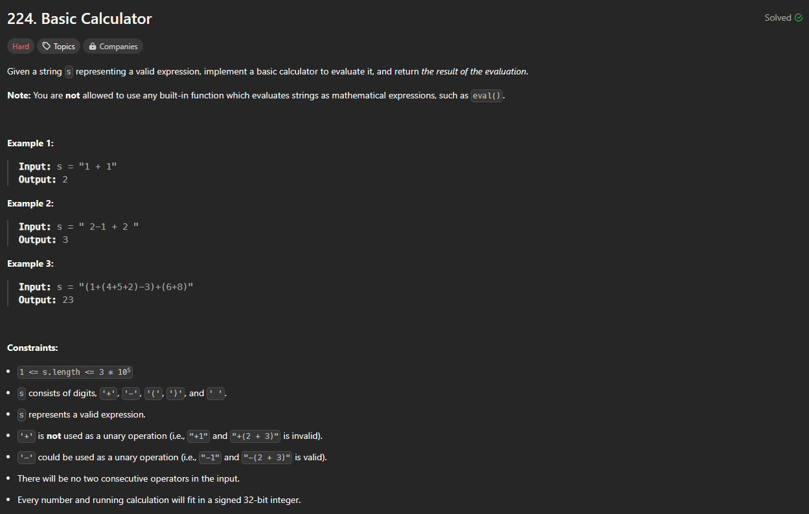

# Approach

## Problem

## Initial thoughts

Use a stack, keep track of sign change, keep track of and deal with parenthesis when they close.

## Initial attempt

I attempted to keep a running stack and also an index array of all of the "(". This way, when I reach a ")", I would get everything from the last index onward frrom the stack and add all of that up. Then I would add that new number back into the stack and keep going. Once I reached the end, I would add up the stack one more time before reaching a final number.

## Obstacles

I was able to get everything going up until the point where I had to deal with double digit numbers. By this point, I just didn't want to go through with it and gave up. I had already been going at this one longer than I had time for.

## Conclusion/Things I would do differently

The solution I looked at went for a similar approach, but just executed it much simpler. They just kept a running total and moved it to and from a separate stack whenever a parenthesis needed dealing with. They also had a clever and simple way to deal with the double digits, so that was cool.

This problem gave me a lot to think about. Hopefully I will be able to do this the next time I attempt it.

## Score

