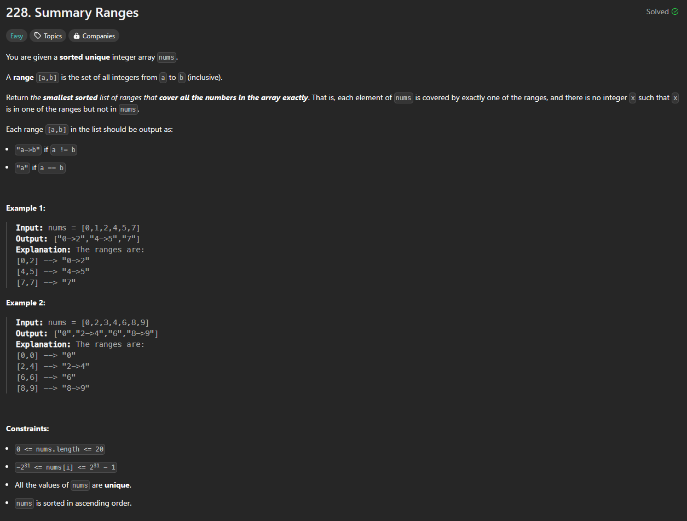

# Approach

## Problem

## Initial thoughts

This was a type of problem that I have not tried before. It is simple enough in what it wants, fortunately.

## Initial attempt

For loop over nums, check to see if the next number is consecutive with the current number. If it is, then keep going, otherwise, append to a results array.

## Obstacles

Main obstacle was dealing with the last index in nums, but that was resolved with a simple check.

## Conclusion/Things I would do differently

My solution is not very clean. It needs crutches to deal with edge cases, so it's not very flexible. I'll fix it when I come back to this problem later.

## Score

