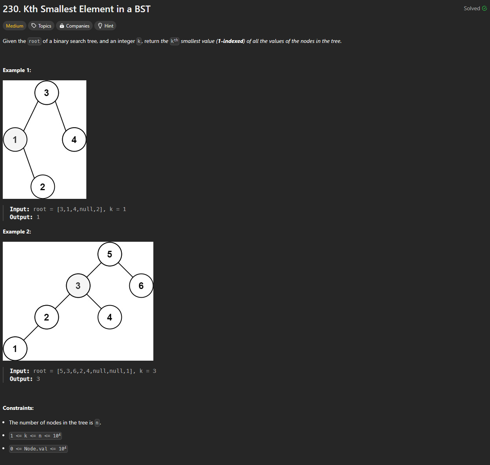

# Approach

## Problem

## Initial thoughts

Finding the kth smallest value in a binary search tree. Fairly simple method is to add all of the nodes to a list and then get the kth - 1 index.

## Initial attempt

This can be done simply by using a helper function that traverses the binary search tree. Due to the fact that it is a BST, we can use inorder traversal to get an automatically sorted list.

## Obstacles

No real obstacles

## Conclusion/Things I would do differently

This method is simple, but it uses a lot of space. Better solutions are out there that also don't necessarily have to go through the entire tree. 

## Score

