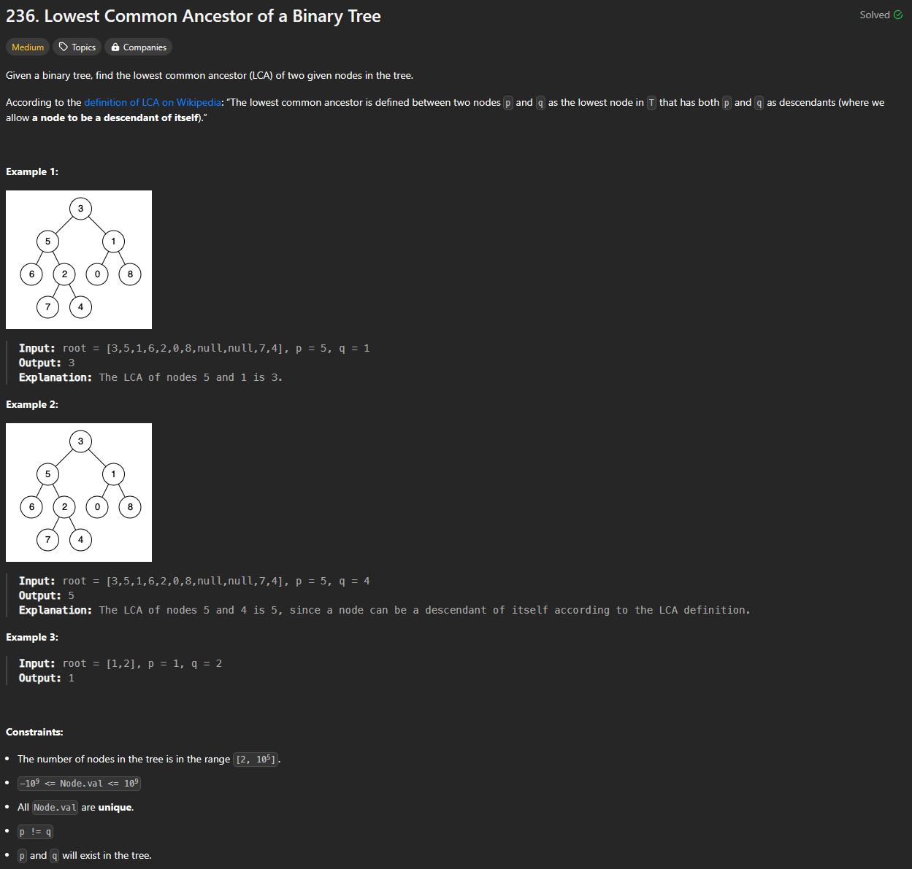

# Approach

## Problem

## Initial thoughts

Binary tree problem that wants us to find the LCA. Fastest way would be to at most search the tree once through, and the simplest way to do that is with recursion. Search left and right by sending root.left and root.right through the same function. The main idea is that we just have to check if either both left and right contain p or q, or just left or just right contain p/q. If both left and right branches contain p and q, then we know that the root is the LCA. Otherwise, we know that if p and q don't exist in one branch, then the other branch will have both. In that case, we just have to go until we find the lowest occurence and return that.

## Initial attempt

Simply self.function(root.left, p, q) annd self.function(root.right, p, q). Then, we return either root, left, or right based on if left and right, just left, or just right.

## Obstacles

No real obstacles

## Conclusion/Things I would do differently

Recursion is typically simple and relatively fast, but never the most efficient in terms of space and sometimes time. The only issue is that it's easier for me to solve these binary tree problems with recursion rather than iterative methods, so that's something I'll have to work on.

## Score

