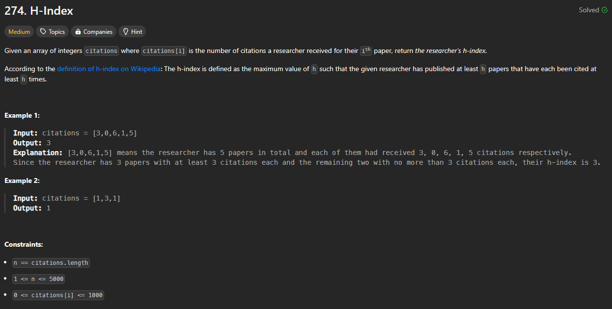
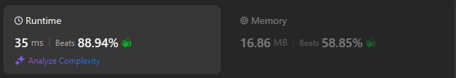

# Approach

## Problem

## Initial thoughts

I approached this problem like any other array problem by seeing how I might solve this in only one pass through. The main constraint being that I needed to somehow keep in mind the maximum h has been while iterating through various numbers. One thing to keep in mind is that we at least know the maximum value that h can ever be: the length of the array.

## Initial attempt

One for loop meant to pass through once. Knowing the maximum value of h, I can reduce or maintain h based on whether a value in the array is less than h.

## Obstacles

The main obstacle with this approach is seen in the first example. 3 is less than 5 at the start of the array, so we would reduce the value of h by one. This is bad because obviously, 3 is the answer. It's doing this because citations is not sorted. Solution? Sort it. I originally used the sorted() method in Python, but it turns out that .sort() is just so much faster because it sorts in place. Once the list was sorted, there were no longer any logical issues with the solution.

## Conclusion/Things I would do differently

The only thing I am unsure about is how one would do this without sorting. Sorting takes up a minimum of O(nlogn), so it doesnn't reach the coveted O(n) that I think it should be able to reach. At least I'm assuming there's an O(n) solution because of the third hint that the problem so kindly gives.

## Score

