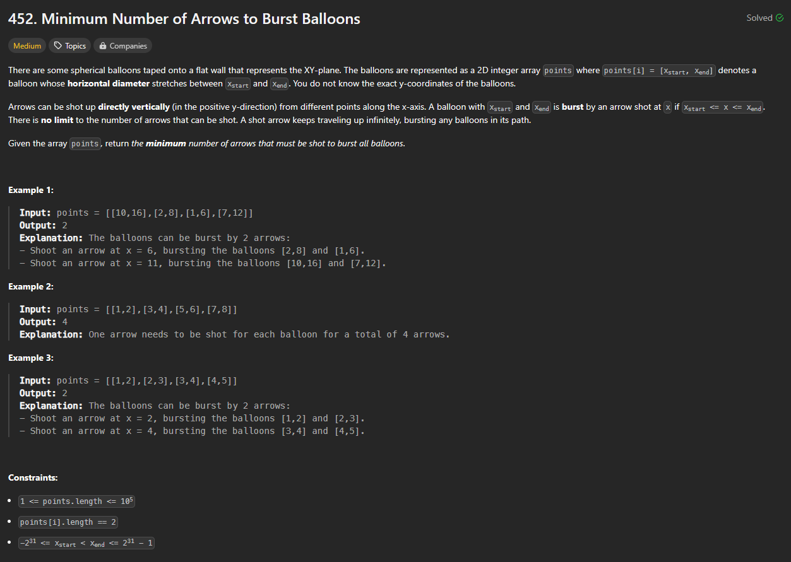
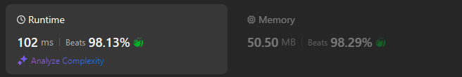

# Approach

## Problem

## Initial thoughts

This was a little difficult to start out with. I think I was simply over thinking about all of the possible ways the balloons could be oriented.

## Initial attempt

My first attempt was very similar to my final solution. It involved sorting the original list by first values. Then, I would keep track of the end of an interval, cur_end, and compare each new interval's start point with the cur_end value. If the new start was bigger, I would add one more to a running count and then update cur_end with the bigger interval's end point.

## Obstacles

The main obstacle was with dealing with certain cases where the first point, or cur_end, was very big, but the up coming intervals were very small. The code wasn't dealing with the cases where multiple intervals could fit inside the first. To deal with that, I just had to update cur_end to fit the minimum of cur_end and the new interval's end.

## Conclusion/Things I would do differently

My solution was very fast. I looked at a few other solutions and saw one that was basically the same as mine, just cleaner. I cleaned up my final solution accordingly. 

## Score

