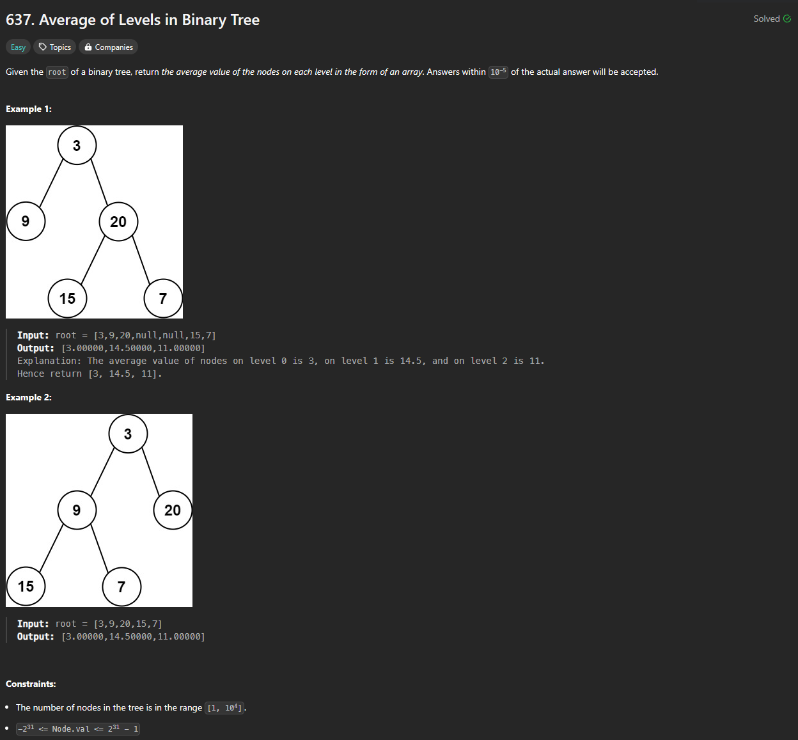
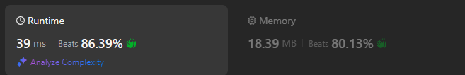

# Approach

## Problem

## Initial thoughts

Use a queue for node storage.

## Initial attempt

Both a stack and a queue probably works for this. I just used queue because why not. It's a fairly simple queue, dequeue process. 

## Obstacles

Main obstacle is figuring out the level system and also the number of nodes to take the average, but that is just a simple taking the length of the queue and for looping that length to represent the level.

## Conclusion/Things I would do differently

The problem itself isn't too difficult. It can look a little messy right out of the gate though.

## Score

