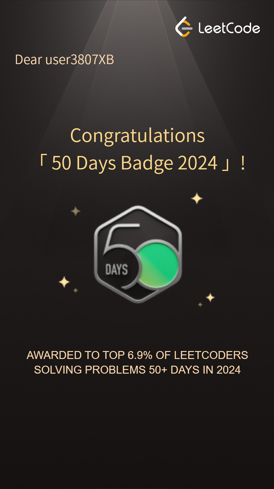

# LeetCode 150

This directory will hold all of the problems from LeetCode's Top interview 150 study plan.

[003](003/thoughts.md)  
[006](006/thoughts.md)  
[009](009/thoughts.md)  
[019](019/thoughts.md)  
[033](033/thoughts.md)  
[036](036/thoughts.md)  
[056](056/thoughts.md)  
[057](057/thoughts.md)  
[061](061/thoughts.md)  
[070](070/thoughts.md)  
[098](098/thoughts.md)  
[102](102/thoughts.md)  
[103](103/thoughts.md)  
[117](117/thoughts.md)  
[148](148/thoughts.md)  
[106](106/thoughts.md)  
[150](150/thoughts.md)  
[162](162/thoughts.md)  
[169](169/thoughts.md)  
[189](189/thoughts.md)  
[199](199/thoughts.md)  
[224](224/thoughts.md)  
[228](228/thoughts.md)  
[230](230/thoughts.md)  
[236](236/thoughts.md)  
[274](274/thoughts.md)  
[452](452/thoughts.md)  
[637](637/thoughts.md)  

## Cool Badge

### LeetPush

Created with :heart: by [LeetPush](https://github.com/husamahmud/LeetPush)

 #### Made by 
 - Tut: [GitHub](https://github.com/TutTrue) - [LinkedIn](https://www.linkedin.com/in/mahmoud-hamdy-8b6825245/)
 - Hüsam: [GitHub](https://github.com/husamahmud) - [LinkedIn](https://www.linkedin.com/in/husamahmud/)

 Happy coding! 🚀